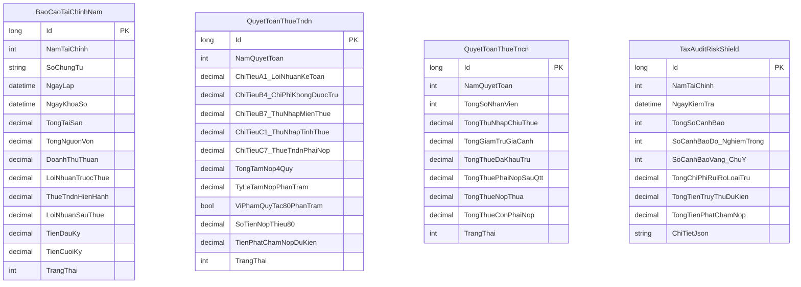

# TÀI LIỆU YÊU CẦU NGHIỆP VỤ & ĐẶC TẢ KỸ THUẬT CHI TIẾT (BRD & TECHNICAL SPECIFICATION)
## PHẦN HỆ BÁO CÁO TÀI CHÍNH TT99/2025/TT-BTC & QUYẾT TOÁN THUẾ CUỐI NĂM (PHASE 5)

---

- **Dự án**: `ninjaTax` - Nền tảng Kế toán & Thuế Doanh nghiệp Tinh gọn
- **Phiên bản tài liệu**: 5.0-RELEASE
- **Tác giả**: BA Lead (20+ năm kinh nghiệm ERP/Fintech) & Kế toán trưởng Doanh nghiệp (20+ năm thực chiến VAS/TT99/Thanh tra Thuế)
- **Chuẩn mực & Luật định áp dụng**:
  - Thông tư số **99/2025/TT-BTC** (Chế độ kế toán doanh nghiệp mới nhất có hiệu lực từ 01/01/2026, thay thế TT 200/2014 & TT 133/2016).
  - Luật Quản lý Thuế số **38/2019/QH14** & Thông tư số **80/2021/TT-BTC**.
  - Nghị định số **91/2022/NĐ-CP** (Sửa đổi bổ sung NĐ 126/2020 về quy định tạm nộp 80% thuế TNDN 4 quý).
  - Thông tư số **78/2014/TT-BTC** & Thông tư số **96/2015/TT-BTC** (Thuế TNDN và các khoản chi không được trừ).
  - Thông tư số **111/2013/TT-BTC** & Nghị quyết **954/2020/UBTVQH14** (Thuế TNCN, giảm trừ gia cảnh, quyết toán thuế TNCN).
  - Thông tư số **45/2013/TT-BTC** (Khung trích khấu hao TSCĐ).
  - Nghị định số **132/2020/NĐ-CP** (Khống chế trần chi phí lãi vay 30% EBITDA trong giao dịch liên kết).

---

## 🛑 ĐÁNH GIÁ VẬN HÀNH MÔI TRƯỜNG PRODUCTION (PROD ENV READINESS AUDIT)

### ❓ Câu hỏi sống còn: *Liệu tính năng BCTC và Quyết toán Thuế hiện tại có thể chạy ngay trên PROD ENV được không?*
### ❌ KẾT LUẬN TỪ KẾ TOÁN TRƯỞNG & BA LEAD: **HOÀN TOÀN CHƯA THỂ CHẠY TRÊN PROD!**

Nếu đưa lên PROD ngay lúc này, doanh nghiệp sẽ **bị phạt hành chính về kế toán (từ 20.000.000 đến 50.000.000 VNĐ theo Nghị định 41/2018/NĐ-CP) và bị cơ quan Thuế ấn định thuế, truy thu phạt chậm nộp**, vì 6 khoảng trống chí mạng sau:

```
+----------------------------------------------------------------------------------------------------+
|                                    6 LỖ HỔNG CHÍ MẠNG TRÊN PRODUCTION                              |
+====================================================================================================+
| 1. CHƯA CÓ ENGINE ÁNH XẠ CHỈ TIÊU BÁO CÁO TÀI CHÍNH TT99 (B01-DN, B02-DN, B03-DN):                 |
|    - Thiếu cơ chế map số dư 2 bên Nợ/Có của TK lưỡng tính (131, 331, 333, 421) lên B01-DN.          |
|    - Chưa tự động tính lũy kế Doanh thu/Chi phí không qua TK 911 lên B02-DN.                       |
+----------------------------------------------------------------------------------------------------+
| 2. THIẾU BÁO CÁO LƯU CHUYỂN TIỀN TỆ (B03-DN) CHUẨN XÁC:                                            |
|    - Phương pháp trực tiếp đòi hỏi phân loại dòng tiền (HĐKD, Đầu tư, Tài chính) từ từng nghiệp vụ  |
|      thu/chi 1111/1121 đối ứng với 131/331/642/211/411.                                            |
+----------------------------------------------------------------------------------------------------+
| 3. BẪY THUẾ NGHỊ ĐỊNH 91/2022/NĐ-CP (TẠM NỘP 80% THUẾ TNDN 4 QUÝ):                                |
|    - Chưa có thuật toán theo dõi số thuế TNDN đã tạm nộp 4 quý so với số phải nộp quyết toán năm.    |
|    - Nếu thiếu 1 đồng dưới 80%, hệ thống phải tự động tính số tiền phạt chậm nộp 0.03%/ngày.       |
+----------------------------------------------------------------------------------------------------+
| 4. THIẾU ENGINE BÓC TÁCH CHI PHÍ KHÔNG HỢP LÝ [CHỈ TIÊU B4] TRÊN TỜ KHAI 03/TNDN:                  |
|    - Chi tiền mặt >= 20 triệu không được tính chi phí hợp lý.                                      |
|    - Chi phí khấu hao xe ô tô dưới 9 chỗ vượt 1.6 tỷ, trích khấu hao vượt khung TT45.              |
|    - Lương nợ quá hạn 30/03 năm sau không chi trả.                                                  |
+----------------------------------------------------------------------------------------------------+
| 5. QUYẾT TOÁN THUẾ TNCN (MẪU 05/QTT-TNCN KÈM BẢNG KÊ 05-1, 05-2, 05-3):                           |
|    - Chưa tổng hợp 12 tháng lương theo từng cá nhân có ủy quyền / không ủy quyền quyết toán.       |
|    - Chưa gom bảng kê 05-2 cho lao động thời vụ có cam kết Mẫu 08 vs khấu trừ 10%.                 |
+----------------------------------------------------------------------------------------------------+
| 6. THIẾU LÁ CHẮN RỦI RO THANH TRA THUẾ (TAX AUDIT RISK SHIELD):                                    |
|    - Không có màn hình cảnh báo sớm 8 bẫy thuế tử thần trước khi Kế toán trưởng ký số nộp BCTC.    |
+----------------------------------------------------------------------------------------------------+
```

---

## 🏛️ 1. TỔNG QUAN HỆ THỐNG BÁO CÁO TÀI CHÍNH CHUẨN THÔNG TƯ 99/2025/TT-BTC

Thông tư 99/2025/TT-BTC mang tính lịch sử, cải cách mạnh mẽ hệ thống kế toán doanh nghiệp Việt Nam, tiệm cận IFRS:
1. **Đổi tên chuẩn mực**: "Bảng cân đối kế toán" đổi thành **"Báo cáo tình hình tài chính" (Mẫu số B01-DN)**.
2. **Loại bỏ vĩnh viễn Tài khoản 911**: Toàn bộ kết chuyển doanh thu, giá vốn, chi phí được kết chuyển trực tiếp vào **Tài khoản 421 (Lợi nhuận sau thuế chưa phân phối)**.
3. **Cấu trúc bộ Báo cáo Tài chính Năm**:
   - **Mẫu B01-DN**: Báo cáo tình hình tài chính (Balance Sheet).
   - **Mẫu B02-DN**: Báo cáo kết quả hoạt động kinh doanh (Income Statement).
   - **Mẫu B03-DN**: Báo cáo lưu chuyển tiền tệ - Phương pháp trực tiếp (Cash Flow Statement).
   - **Mẫu B09-DN**: Bản thuyết minh Báo cáo tài chính (Notes to the Financial Statements).

```
   +--------------------------------------------------------------------------+
   |                       HỆ THỐNG SỔ CÁI VÀ BÁO CÁO TT99                    |
   +--------------------------------------------------------------------------+
                                       |
                   +-------------------+-------------------+
                   |                                       |
                   v                                       v
         [SỔ NHẬT KÝ CHUNG]                     [BẢNG CÂN ĐỐI TÀI KHOẢN]
         (Core General Ledger)                  (Trial Balance - 8 Cột)
                   |                                       |
                   +-------------------+-------------------+
                                       |
            +--------------------------+--------------------------+
            |                          |                          |
            v                          v                          v
     [MẪU B01-DN]               [MẪU B02-DN]               [MẪU B03-DN]
     BÁO CÁO TÌNH HÌNH          KẾT QUẢ KINH DOANH         LƯU CHUYỂN TIỀN TỆ
     TÀI CHÍNH                  (Doanh thu, Chi phí,       (Trực tiếp: Tiền vào,
     (Tài sản = Nợ + Vốn)        Lãi/Lỗ ròng)               Tiền ra 111/112)
            |                          |                          |
            +--------------------------+--------------------------+
                                       |
                                       v
                              [MẪU B09-DN THUYẾT MINH]
                                       |
                                       v
                     +-----------------------------------+
                     | QUYẾT TOÁN THUẾ CUỐI NĂM (TT 80)  |
                     |  - Mẫu 03/TNDN (Kèm B4, 80% NĐ91) |
                     |  - Mẫu 05/QTT-TNCN (05-1, 05-2)   |
                     |  - Tax Audit Risk Shield (8 Bẫy)  |
                     +-----------------------------------+
```

---

## 📋 2. ĐẶC TẢ CHI TIẾT TỪNG BIỂU MẪU BÁO CÁO

### 2.1. Mẫu B01-DN: Báo cáo Tình hình Tài chính (Balance Sheet)
- **Phương trình kế toán bắt buộc**: $\text{Tổng Tài Sản (Mã 270)} \equiv \text{Tổng Nguồn Vốn (Mã 440)}$.
- **Quy tắc bù trừ số dư (Bóc tách lưỡng tính)**:
  - Tài khoản 131: Dư Nợ đưa vào **Mã 131 (Phải thu ngắn hạn khách hàng)**, Dư Có đưa vào **Mã 312 (Người mua trả tiền trước ngắn hạn)**. Tuyệt đối không bù trừ số dư ròng giữa các khách hàng khác nhau.
  - Tài khoản 331: Dư Có đưa vào **Mã 311 (Phải trả người bán ngắn hạn)**, Dư Nợ đưa vào **Mã 132 (Trả trước cho người bán ngắn hạn)**.
  - Tài khoản 2141: Ghi âm (trong ngoặc đơn) tại **Mã 222 (Giá trị hao mòn lũy kế)**.
  - Tài khoản 421: Lợi nhuận âm ghi âm tại **Mã 421 (Lợi nhuận sau thuế chưa phân phối)**.

```
+---------------------------------------------------------------------------------------+
| MÃ SỐ | CHỈ TIÊU TRÊN B01-DN (BÁO CÁO TÌNH HÌNH TÀI CHÍNH)   | CÁCH LẤY SỐ LIỆU SỔ CÁI |
+=======+======================================================+=========================+
| 100   | A. TÀI SẢN NGẮN HẠN                                  | 110 + 120 + 130 + 140   |
| 110   | I. Tiền và tương đương tiền                          | Dư Nợ (TK 1111 + 1121)  |
| 130   | II. Phải thu ngắn hạn                                | Dư Nợ chi tiết TK 131   |
| 140   | III. Hàng tồn kho                                    | Dư Nợ (TK 152 + 156)    |
| 200   | B. TÀI SẢN DÀI HẠN                                   | 220 + 260               |
| 220   | I. Tài sản cố định hữu hình                          | Mã 221 + Mã 222         |
| 221   |    - Nguyên giá                                      | Dư Nợ TK 211            |
| 222   |    - Giá trị hao mòn lũy kế                          | (Dư Có TK 2141 - Số âm) |
| 260   | II. Chi phí trả trước dài hạn (CCDC phân bổ)         | Dư Nợ TK 242            |
| 270   | TỔNG CỘNG TÀI SẢN (100 + 200)                        | Mã 100 + Mã 200         |
+-------+------------------------------------------------------+-------------------------+
| 300   | C. NỢ PHẢI TRẢ                                       | Mã 310                  |
| 310   | I. Nợ ngắn hạn                                       | 311 + 312 + 313 + 314   |
| 311   |    1. Phải trả người bán ngắn hạn                    | Dư Có chi tiết TK 331   |
| 313   |    2. Thuế và các khoản phải nộp Nhà nước            | Dư Có chi tiết TK 333   |
| 314   |    3. Phải trả người lao động                        | Dư Có TK 334            |
| 319   |    4. Phải trả, phải nộp ngắn hạn khác (Bảo hiểm)   | Dư Có chi tiết TK 338   |
| 400   | D. VỐN CHỦ SỞ HỮU                                    | Mã 410                  |
| 411   |    1. Vốn đầu tư của chủ sở hữu                      | Dư Có TK 411            |
| 421   |    2. Lợi nhuận sau thuế chưa phân phối              | Dư Có/Nợ TK 421         |
| 440   | TỔNG CỘNG NGUỒN VỐN (300 + 400)                      | Mã 300 + Mã 400         |
+---------------------------------------------------------------------------------------+
```

---

### 2.2. Mẫu B02-DN: Báo cáo Kết quả Hoạt động Kinh doanh (Income Statement)
Cơ chế tính lũy kế năm không dùng TK 911:
- Doanh thu thuần $\text{Mã 10} = \text{Mã 01} (\text{TK 511}) - \text{Mã 02} (\text{TK 521})$.
- Lợi nhuận gộp $\text{Mã 20} = \text{Mã 10} - \text{Mã 11} (\text{TK 632})$.
- Lợi nhuận thuần HĐKD $\text{Mã 30} = \text{Mã 20} + \text{Mã 21} (\text{TK 515}) - \text{Mã 22} (\text{TK 635}) - \text{Mã 25} (\text{TK 641}) - \text{Mã 26} (\text{TK 642})$.
- Lợi nhuận khác $\text{Mã 40} = \text{Mã 31} (\text{TK 711}) - \text{Mã 32} (\text{TK 811})$.
- Tổng lợi nhuận kế toán trước thuế $\text{Mã 50} = \text{Mã 30} + \text{Mã 40}$.
- Chi phí thuế TNDN hiện hành $\text{Mã 51} = \text{TK 8211/3334}$.
- Lợi nhuận sau thuế $\text{Mã 60} = \text{Mã 50} - \text{Mã 51}$.

---

### 2.3. Mẫu B03-DN: Báo cáo Lưu chuyển Tiền tệ (Phương pháp Trực tiếp)
Theo dõi dòng tiền thực thu / thực chi qua TK 1111 và TK 1121:
- **Mã 01**: Tiền thu từ bán hàng, cung cấp dịch vụ (Nợ 111, 112 / Có 511, 131, 33311).
- **Mã 02**: Tiền chi trả cho người bán hàng hóa, dịch vụ (Nợ 331, 152, 156 / Có 111, 112).
- **Mã 03**: Tiền chi trả cho người lao động (Nợ 334 / Có 111, 112).
- **Mã 05**: Tiền chi nộp thuế TNDN (Nợ 3334 / Có 111, 112).
- **Mã 06**: Tiền chi nộp thuế GTGT, TNCN, bảo hiểm, phí, lệ phí (Nợ 3331, 3335, 338 / Có 111, 112).
- **Mã 21**: Tiền chi mua sắm, xây dựng TSCĐ và CCDC dài hạn (Nợ 211, 242 / Có 111, 112).
- **Mã 31**: Tiền thu từ góp vốn chủ sở hữu (Nợ 111, 112 / Có 411).
- **Khớp số**: $\text{Mã 70 (Tiền cuối kỳ)} = \text{Mã 60 (Tiền đầu kỳ)} + \text{Mã 50 (Lưu chuyển thuần)} \equiv \text{Số dư TK 111 + 112}$.

---

## ⚖️ 3. QUYẾT TOÁN THUẾ CUỐI NĂM & BẪY THUẾ TỬ THẦN

### 3.1. Tờ khai Quyết toán Thuế TNDN (Mẫu 03/TNDN theo TT 80/2021)
- Lấy Lợi nhuận kế toán trước thuế từ **Chỉ tiêu [A1] = Mã 50 trên B02-DN**.
- Tự động bóc tách **Chỉ tiêu [B4] (Các khoản chi không được trừ khi xác định thu nhập chịu thuế TNDN)**:
  - Chi phí mua hàng $\ge 20.000.000$ VNĐ thanh toán tiền mặt.
  - Chi phí trích khấu hao TSCĐ vượt mức khung tối đa quy định tại Thông tư 45/2013/TT-BTC.
  - Chi phí phân bổ CCDC vượt quá 36 tháng quy định tại Thông tư 96/2015/TT-BTC.
  - Chi phí tiền lương chưa thanh toán thực tế quá ngày 30/03 năm kế tiếp và không trích lập quỹ dự phòng lương (TT 96/2015).
  - Chi phí phạt vi phạm hành chính, phạt thuế, phạt chậm nộp.
  - Chi phí lãi vay vượt trần 30% EBITDA đối với doanh nghiệp có quan hệ liên kết (Nghị định 132/2020/NĐ-CP).
- **Bẫy Thuế Tạm Nộp 80% (Nghị định 91/2022/NĐ-CP)**:
  $$\text{Điều kiện an toàn}: \sum_{Q=1}^{4} T_{\text{tamnop}}(Q) \ge 80\% \times \text{Thuế TNDN Quyết Toán Năm [C7]}$$
  - Nếu vi phạm: Cảnh báo đỏ rực, tự động tính số tiền phạt chậm nộp với lãi suất $0.03\%/\text{ngày}$ tính từ ngày 31/01 năm sau.

### 3.2. Tờ khai Quyết toán Thuế TNCN (Mẫu 05/QTT-TNCN theo TT 80/2021)
- **Bảng kê 05-1/BK-QTT-TNCN**: Dành cho cá nhân cư trú có HĐLĐ từ 3 tháng trở lên:
  - Tổng thu nhập chịu thuế, thu nhập được miễn thuế (OT, ăn trưa).
  - Giảm trừ bản thân (132 triệu/năm), giảm trừ người phụ thuộc (52.8 triệu/năm/người), bảo hiểm bắt buộc đã nộp (10.5%).
  - Thuế đã khấu trừ trong năm, thuế phải nộp sau quyết toán, số thuế nộp thừa / nộp thiếu.
  - Cờ ủy quyền quyết toán thay cho doanh nghiệp.
- **Bảng kê 05-2/BK-QTT-TNCN**: Dành cho lao động thời vụ / thử việc dưới 3 tháng:
  - Thu nhập từ 2.000.000 VNĐ trở lên đã khấu trừ 10%.
  - Thu nhập có Cam kết Mẫu 08/CK-TNCN không khấu trừ.
- **Bảng kê 05-3/BK-QTT-TNCN**: Danh sách người phụ thuộc đã cấp MST.

---

### 3.3. Tax Audit Risk Shield: Bộ 8 Chốt chặn Kiểm tra Bẫy Thuế Toàn Hệ Thống

```
+----------------------------------------------------------------------------------------------------+
|                         TAX AUDIT RISK SHIELD - 8 CHỐT CHẶN BẪY THUẾ TỬ THẦN                        |
+====================================================================================================+
| [BẪY 1] Hóa đơn mua vào >= 20.000.000 VNĐ thanh toán tiền mặt (TT 219/2013 & TT 26/2015)           |
|         -> Rủi ro: Bị loại toàn bộ chi phí được trừ [B4] và truy thu 100% thuế GTGT đầu vào.       |
+----------------------------------------------------------------------------------------------------+
| [BẪY 2] Âm quỹ tiền mặt thời điểm (Negative Cash Balance)                                          |
|         -> Rủi ro: Dấu hiệu trốn doanh thu / mua khống hóa đơn; thanh tra thuế ấn định doanh thu. |
+----------------------------------------------------------------------------------------------------+
| [BẪY 3] Tạm nộp 4 quý < 80% thuế TNDN quyết toán năm (Nghị định 91/2022/NĐ-CP)                    |
|         -> Rủi ro: Phạt chậm nộp 0.03%/ngày tính từ ngày 31/01 năm kế tiếp.                         |
+----------------------------------------------------------------------------------------------------+
| [BẪY 4] Nợ lương người lao động quá hạn ngày 30/03 năm sau (Thông tư 96/2015/TT-BTC)              |
|         -> Rủi ro: Bị loại khỏi chi phí hợp lý khi quyết toán nếu không trích lập quỹ dự phòng <=17%.|
+----------------------------------------------------------------------------------------------------+
| [BẪY 5] Khấu hao TSCĐ vượt khung TT 45/2013 hoặc phân bổ CCDC vượt quá 36 tháng (TT 78/2014)     |
|         -> Rủi ro: Loại phần chi phí trích vượt đưa vào chỉ tiêu B4.                               |
+----------------------------------------------------------------------------------------------------+
| [BẪY 6] Khấu trừ thiếu 10% thuế TNCN thời vụ >= 2M không có MST hoặc không có Cam kết 08           |
|         -> Rủi ro: Doanh nghiệp bị truy thu 10% và phạt chậm nộp 0.03%/ngày.                        |
+----------------------------------------------------------------------------------------------------+
| [BẪY 7] Bán hàng dưới giá vốn không có lý do hợp lý (thanh lý, hàng hư hỏng)                      |
|         -> Rủi ro: Cơ quan thuế ấn định giá bán theo giá thị trường (Điều 50 Luật Quản lý Thuế).  |
+----------------------------------------------------------------------------------------------------+
| [BẪY 8] Chi phí lãi vay vượt trần 30% EBITDA đối với Doanh nghiệp có giao dịch liên kết (NĐ 132)   |
|         -> Rủi ro: Bị loại toàn bộ phần lãi vay vượt mức 30% EBITDA khi tính thuế TNDN.            |
+----------------------------------------------------------------------------------------------------+
```

---

## 📐 4. KIẾN TRÚC MÃ NGUỒN & HỢP ĐỒNG SEAM (CODEBASE DESIGN)

### 4.1. Domain Entities & Database Schema



### 4.2. Deep Service Seams

```csharp
namespace ninjaTax.Models.Services;

public interface IFinancialReportService
{
    Task<BaoCaoTinhHinhTaiChinhViewModel> LapBaoCaoB01Async(int namTaiChinh);
    Task<BaoCaoKetQuaKinhDoanhViewModel> LapBaoCaoB02Async(int namTaiChinh);
    Task<BaoCaoLuuChuyenTienTeViewModel> LapBaoCaoB03Async(int namTaiChinh);
    Task<ThuyetMinhBctcViewModel> LapThuyetMinhB09Async(int namTaiChinh);
    Task KhoaSoBctcNamAsync(int namTaiChinh);
}

public interface ITaxFinalizationService
{
    Task<QuyetToanTndnViewModel> LapQuyetToanTndnAsync(int namTaiChinh);
    Task<QuyetToanTncnViewModel> LapQuyetToanTncnAsync(int namTaiChinh);
    Task LuuQuyetToanTndnAsync(QuyetToanTndnViewModel model);
}

public interface ITaxAuditShieldService
{
    Task<TaxAuditShieldReportViewModel> QuetToanBoBayThueAsync(int namTaiChinh);
}
```

---

## 🎨 5. THIẾT KẾ GIAO DIỆN & TRẢI NGHIỆM NGƯỜI DÙNG (UI/UX WIREFRAMES)

### 5.1. Dashboard Báo Cáo Tài Chính & Bẫy Thuế (ASCII Art Wireframe)

```
+======================================================================================================+
| ninjaTax TT99 | [Dashboard] [Mua Hàng] [Bán Hàng] [Kho] [Thu/Chi] [TSCĐ] [Lương] | [BCTC & THUẾ]     |
+======================================================================================================+
| KỲ BÁO CÁO: [ Năm 2026 v ]    TRẠNG THÁI: [ ĐANG MỞ - CHƯA KHÓA SỔ ]           [ Quét Bẫy Thuế Ngay ]|
+------------------------------------------------------------------------------------------------------+
| [!] CẢNH BÁO TỬ THẦN TỪ TAX AUDIT RISK SHIELD:                                                       |
|  - Cảnh báo ĐỎ: Phát hiện 2 hóa đơn >= 20 triệu chi tiền mặt (Tổng tiền: 65.000.000 đ) -> Loại B4!   |
|  - Cảnh báo ĐỎ: Thuế TNDN 4 quý mới tạm nộp 65% (< 80% NĐ 91/2022). Nộp thiếu: 12.000.000 đ.         |
|  - Dự kiến tiền chậm nộp: 324.000 đ (0.03%/ngày).                                                    |
+------------------------------------------------------------------------------------------------------+
| +-------------------------+ +-------------------------+ +-------------------------+ +---------------+ |
| | B01: TÌNH HÌNH TÀI CHÍNH| | B02: KẾT QUẢ KINH DOANH | | B03: LƯU CHUYỂN TIỀN TỆ | | 03/TNDN (QTT) | |
| | Tài sản:  1.850.000.000 | | Doanh thu:  2.400.000.000 | | Dòng tiền KD: +320M   | | Lãi KT: 450M  | |
| | Nguồn vốn: 1.850.000.000| | Giá vốn:    1.500.000.000 | | Dòng tiền ĐT: -150M   | | B4:      65M  | |
| | [ CÂN ĐỐI 100% ]        | | Chi phí QL:   450.000.000 | | Tiền cuối kỳ:  480M   | | Thuế:   103M  | |
| | [ Xem B01 ] [ In PDF ]  | | Lãi ròng:     360.000.000 | | [ Xem B03 ] [ In PDF ]| | [ Xem 03/TNDN]| |
| +-------------------------+ +-------------------------+ +-------------------------+ +---------------+ |
+------------------------------------------------------------------------------------------------------+
```

---

## 🗺️ 6. KẾ HOẠCH & LỘ TRÌNH TRIỂN KHAI CHI TIẾT (IMPLEMENTATION ROADMAP)

### Giai đoạn 1: Chuẩn bị Domain Entities & CSDL (Sprint 1)
- Tạo các thực thể `BaoCaoTaiChinhNam`, `ChiTietBaoCaoTaiChinh`, `QuyetToanTndnNam`, `QuyetToanTncnNam`.
- Tạo migration EF Core SQLite / Multi-DB, cấu hình kiểu dữ liệu `decimal(19,4)` và `TEXT` cho SQLite.
- Kiểm thử tạo bảng và cập nhật CSDL bằng `dotnet ef database update`.

### Giai đoạn 2: Phát triển Core Engine BCTC TT99 (Sprint 2)
- Xây dựng `FinancialReportService`:
  - Thuật toán bóc tách 2 bên TK 131, 331, 333 lập **Mẫu B01-DN**.
  - Thuật toán kết chuyển ảo doanh thu chi phí không qua TK 911 lập **Mẫu B02-DN**.
  - Thuật toán phân tích dòng tiền trực tiếp đối ứng 111/112 lập **Mẫu B03-DN**.
  - Kiểm tra điều kiện cân đối kép: $\text{Tổng Tài sản} \equiv \text{Tổng Nguồn vốn}$ và $\text{Mã 60 B02} \equiv \Delta \text{TK 4212}$.

### Giai đoạn 3: Phát triển Quyết toán Thuế TNDN, TNCN & Bẫy 80% NĐ 91 (Sprint 3)
- Xây dựng `TaxFinalizationService`:
  - Tờ khai Mẫu 03/TNDN: bóc tách chỉ tiêu A1, B4, C1, C7.
  - Công thức kiểm tra 80% 4 quý: $T_{\text{tamnop}} \ge 80\% \times C7$. Tự động tính phạt chậm nộp $0.03\%/\text{ngày}$.
  - Tờ khai Mẫu 05/QTT-TNCN: tổng hợp 12 tháng từ `BangLuongThang`, bóc tách Bảng kê 05-1, 05-2, 05-3.

### Giai đoạn 4: Tax Audit Risk Shield Engine (Sprint 4)
- Xây dựng `TaxAuditShieldService`:
  - Quét 8 chốt chặn tử thần: HĐ $\ge 20$M tiền mặt, âm quỹ tiền mặt theo ngày, tạm nộp thiếu 80%, nợ lương quá hạn 30/03, trích KH vượt khung TT45, thiếu khấu trừ 10% TNCN, bán dưới giá vốn, lãi vay 30% EBITDA.
  - Xuất báo cáo rủi ro thuế kèm trích dẫn văn bản luật và số tiền phạt ước tính.

### Giai đoạn 5: Web Controllers & Razor Views (Sprint 5)
- Tạo `BaoCaoTaiChinhController`, `QuyetToanThueController`, `TaxAuditShieldController`.
- Xây dựng giao diện xem và in ấn B01-DN, B02-DN, B03-DN, B09-DN, 03/TNDN, 05/QTT-TNCN chuẩn mực in A4 landscape/portrait.

### Giai đoạn 6: Kiểm thử TDD Toàn diện & Xác thực (Sprint 6)
- Xây dựng bộ test suite xUnit:
  - `BalanceSheetReconciliationTests.cs`: Kiểm tra cân đối B01-DN và khớp nối B02-DN.
  - `CorporateIncomeTax80PercentTests.cs`: Kiểm tra bẫy 80% NĐ 91/2022 và phạt chậm nộp.
  - `TaxAuditRiskShieldTests.cs`: Kiểm tra phát hiện 8 bẫy thuế tử thần.
- Chạy `dotnet test` đạt 100% Green.
- Git commit, push và nghiệm thu.
