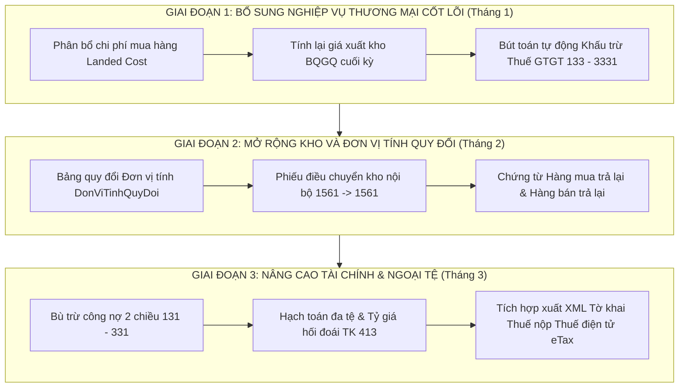

# BÁO CÁO KIỂM TOÁN VÀ ĐÁNH GIÁ CHUYÊN SÂU HỆ THỐNG KẾ TOÁN NINJATAX
## ĐỐI SOÁT VỚI TIÊU CHUẨN ERP DOANH NGHIỆP THƯƠNG MẠI (MISA AMIS, FAST BUSINESS, BRAVO 8R3)
**Chức danh thẩm định:** Kế toán trưởng kiêm Chuyên gia Tư vấn Thuế & Hệ thống ERP (20+ năm kinh nghiệm)  
**Ngày thẩm định:** 29/09/2026  
**Cơ sở pháp lý & Chuẩn mực:** TT 99/2025/TT-BTC, TT 200/2014/TT-BTC, TT 133/2016/TT-BTC, VAS 02 (Hàng tồn kho), VAS 03 (TSCĐ), VAS 14 (Doanh thu), TT 78/2021/TT-BTC, NĐ 123/2020/NĐ-CP.

---

### I. EXECUTIVE SUMMARY (TÓM TẮT ĐIỀU HÀNH)

Hệ thống `ninjaTax` được thiết kế trên nền tảng .NET 10 (`net10.0`), kiến trúc Clean MVC với các service miền sâu (`Models/Services/`), tích hợp cơ chế bảo vệ bất biến kế toán (Accounting Invariants) nghiêm ngặt hơn nhiều phần mềm thương mại hiện hành.

#### Các thành tựu đạt chuẩn Production (PROD-Level Core):
1. **Kiểm soát Bất biến Tài khoản 911 (Phase 10 & TT99/2025/TT-BTC):**
   - Độc quyền xử lý tại `PeriodClosingService.cs`: Nghiêm cấm chứng từ tác nghiệp (Mua, Bán, Thu, Chi, Xuất nhập kho) định khoản vào TK 911 (kiểm tra runtime chặn nạp tại `InventoryService.cs` dòng 260, 492).
   - Kết chuyển 3 chặng chuẩn chỉ: Doanh thu (5xx, 7xx) -> Có 911; Chi phí (6xx, 8xx) -> Nợ 911; Lãi/Lỗ ròng xóa sổ 911 về đúng `DuNo == 0 && DuCo == 0`, chuyển sang TK 4212.
2. **Nguyên tắc Bất biến Không bù trừ 2 chiều Bảng Cân đối tài khoản 8 cột (Trial Balance):**
   - Triển khai tại `GeneralLedgerService.cs` (`LayBangCanDoiTaiKhoanAsync`, dòng 215-245) và `FinancialReportService.cs` (dòng 548-589): Tài khoản lưỡng tính (`TinhChat = LuongTinh`: 131, 331, 138, 338) được bóc tách số dư Nợ và số dư Có theo từng thực thể đối tượng (`DoiTuongId`). Triệt tiêu hoàn toàn lỗi bù trừ công nợ gộp vi phạm chuẩn mực VAS/TT99.
3. **Cơ chế Chống xuất âm kho thời gian thực (Anti-Negative Stock - VAS 02):**
   - `InventoryService.cs` (`ValidateStockAvailabilityAsync`, dòng 90-132) chặn đứng tức thì mọi giao dịch xuất kho hoặc sửa/hủy phiếu nhập kho (`HuyGhiSoPhieuNhapKhoAsync`, dòng 329-338) nếu làm tồn kho lũy kế xuống dưới 0.
4. **Bảo vệ Ngày khóa sổ (`NgayKhoaSo` Book-Lock):**
   - Chặn toàn bộ thao tác thêm, sửa, xóa, ghi sổ hoặc hủy kết chuyển đối với các giao dịch có `NgayHachToan <= NgayKhoaSo`.
5. **Lá chắn rủi ro thanh tra thuế (Tax Audit Shield):**
   - Phát hiện 8 bẫy thuế trọng yếu (Giao dịch > 20 triệu thanh toán tiền mặt, âm quỹ thời điểm, chậm nộp thuế TNDN, khấu trừ thuế vãng lai).

#### Khoảng cách trọng yếu (Critical Gaps) so với ERP Thương mại (MISA / FAST / BRAVO):
Mặc dù lõi hạch toán sổ cái (GL Engine) rất vững chắc, nhưng **nghiệp vụ tác nghiệp thương mại chuyên sâu (Commercial/Trading Sub-ledgers)** vẫn còn thiếu các module bản lề:
1. **Phân bổ chi phí mua hàng (Landed Cost Allocation):** Chưa có bảng phân bổ chi phí vận chuyển, bốc xếp, bảo hiểm vào nguyên giá lô hàng nhập kho (VAS 02).
2. **Phương pháp tính giá xuất kho:** Mới chỉ có BQGQ liên hoàn tức thời tạm tính; chưa có công cụ chạy "Tính lại giá xuất kho BQGQ cuối kỳ" (Period-End Weighted Average Recalculation Engine) và FIFO theo lô.
3. **Chiết khấu thương mại & Hàng bán bị trả lại:** Mua/Bán mới chỉ trừ trực tiếp trên dòng hóa đơn; chưa có chứng từ độc lập ghi nhận Hàng mua trả lại, Giảm giá hàng mua, Chiết khấu thương mại đạt doanh số theo đợt (TK 5211, 5212, 5213).
4. **Quản lý Đơn vị tính quy đổi (Dual/Multi UoM):** Chưa hỗ trợ thùng <-> lon, két <-> chai, kg <-> tấn.
5. **Quản lý kho nội bộ:** Chưa có chứng từ Điều chuyển kho (1561 kho A -> 1561 kho B) và Lắp ráp/Tháo dỡ combo hàng hóa.
6. **Bù trừ công nợ liên đối tượng & Quản lý ngoại tệ (Multi-currency/VAS 10):** Chưa hỗ trợ bù trừ giữa 131 và 331 khi cùng một pháp nhân vừa là khách hàng vừa là nhà cung cấp; chưa hạch toán chênh lệch tỷ giá phát sinh và đánh giá lại cuối kỳ (TK 413, 515, 635).

---

### II. MA TRẬN ĐỐI SOÁT CHI TIẾT (GAP ANALYSIS MATRIX)

| Phân hệ nghiệp vụ | Tiêu chuẩn ERP (MISA / FAST / BRAVO) | Hiện trạng `ninjaTax` | Đánh giá & Rủi ro Kế toán / Thuế |
|---|---|---|---|
| **1. Mua hàng (Purchasing & AP)** | - Hóa đơn mua hàng kiêm nhập kho hoặc không kiêm kho. - Phân bổ chi phí mua hàng/vận chuyển theo Số lượng hoặc Giá trị. - Hàng mua trả lại (Có 1561/Nợ 331/Có 1331). - Phân tách VAT 1331 (hàng hóa) và 1332 (TSCĐ). | - `HachToanMuaHangService.cs`: Hạch toán Nợ 152/156, Nợ 1331, Có 331. - Chiết khấu trừ trực tiếp vào giá trị dòng. - Chưa có phân bổ landed cost. - Chưa có module hàng mua trả lại. | **MỨC ĐỘ: CAO** Nguyên giá hàng nhập bị sai lệch nếu có phí vận chuyển độc lập (vi phạm VAS 02). Kế toán phải định khoản tay phức tạp. |
| **2. Bán hàng (Sales & AR)** | - Phát hành HĐĐT (NĐ 123/TT 78). - Tách biệt hóa đơn và phiếu xuất. - Chiết khấu thương mại sau bán hàng (TK 5211). - Hàng bán trả lại kiêm nhập kho (TK 5212, 632). - Đơn giá vốn tự động lấy theo phương pháp đăng ký. | - `HachToanBanHangService.cs`: Tự động sinh đồng thời DT (Nợ 131/Có 511, 3331) và GV (Nợ 632/Có 1561). - Mô phỏng ký số SHA256 & mã CQT. - Chiết khấu trừ thẳng vào doanh thu. - Chưa có chứng từ trả lại hàng. | **MỨC ĐỘ: TRUNG BÌNH - CAO** Khi khách hàng trả hàng hoặc chiết khấu doanh số cuối tháng, thiếu chứng từ hạch toán chuyên dụng làm sai lệch chỉ tiêu Mã 02 trên B02-DN. |
| **3. Kho (Inventory S10-DN)** | - Sổ S10-DN nhiều kho, thẻ kho chi tiết. - Tính giá xuất BQGQ cuối kỳ hoặc FIFO. - Đơn vị tính phụ (thùng/hộp) theo hệ số quy đổi. - Phiếu xuất điều chuyển kho nội bộ (PXK kiêm VC nội bộ). - Lắp ráp / tháo dỡ định mức. | - `InventoryService.cs`: Đa kho (`Kho.cs`), S10-DN đối chiếu GL. - Chặn xuất âm kho tuyệt đối. - Giá vốn BQGQ tức thời tại thời điểm xuất. - Chỉ có 1 ĐVT cơ bản. - Chưa có điều chuyển kho nội bộ. | **MỨC ĐỘ: CAO** Công ty thương mại phân phối không thể kinh doanh nếu không có ĐVT quy đổi (nhập thùng bán lẻ lon/gói). Giá vốn BQ tức thời bị phụ thuộc thứ tự nhập xuất. |
| **4. Tiền & Ngân hàng (Treasury)** | - Phiếu thu/chi tiền mặt (1111/1112). - Báo Có/Báo Nợ ngân hàng (1121/1122). - Quản lý đa tiền tệ (USD, EUR), tỷ giá giao dịch thực tế, tỷ giá ghi sổ đích danh/BQCQ, xử lý chênh lệch tỷ giá 515/635 (VAS 10). | - `ThuChiService.cs`: Thu/Chi tiền mặt và ngân hàng VNĐ rất chuẩn. - Kiểm tra âm quỹ thời điểm. - Đã có entity `ExchangeRateHistory.cs` nhưng chưa tích hợp vào hạch toán giao dịch ngoại tệ. | **MỨC ĐỘ: TRUNG BÌNH** Doanh nghiệp thương mại xuất nhập khẩu hoặc bán hàng thu USD sẽ gặp khó khăn vì chưa hạch toán tỷ giá tự động. |
| **5. Công nợ (AR / AP)** | - Đối trừ công nợ theo hóa đơn (Invoice matching). - Phân tích tuổi nợ (Aging report: 0-30, 31-60, >90 ngày). - Bù trừ công nợ 2 chiều (131 vs 331 cùng đối tượng). - Biên bản đối chiếu công nợ xác nhận tròn kỳ. | - `CongNoService.cs`: Đối trừ hóa đơn theo chỉ định và FIFO tự động. - Báo cáo tuổi nợ 5 dải rất tốt (`BaoCaoTuoiNoPhaiThuAsync`). - Chưa có cơ chế bù trừ cấn trừ 2 chiều 131 - 331. | **MỨC ĐỘ: TRUNG BÌNH** Cần bổ sung chứng từ Bù trừ công nợ 131-331 (Nợ 331 / Có 131) để thanh toán chéo khi đại lý vừa mua vừa bán hàng. |
| **6. Đóng sổ & Báo cáo TT99** | - Kết chuyển tự động Doanh thu/Chi phí qua TK 911. - Không còn số dư 911. - Bảng Cân đối kế toán B01-DN, KQKD B02-DN, LCTT B03-DN (Trực tiếp & Gián tiếp), CĐTK 8 cột. - Khóa sổ kỳ kế toán. | - `PeriodClosingService.cs`: 100% tuân thủ TT99/2025/TT-BTC, đóng sổ qua TK 911, sạch số dư sang 4212. - `FinancialReportService.cs`: Lập B01, B02, B03, B09, Báo cáo bộ phận. - `GeneralLedgerService.cs`: Bảng CĐTK 8 cột không bù trừ 2 chiều. | **MỨC ĐỘ: ĐẠT CHUẨN XUẤT SẮC** Lõi báo cáo tài chính và kết chuyển đóng sổ thuộc nhóm hàng đầu thị trường về độ tuân thủ chuẩn mực. |
| **7. Thuế & Hóa đơn** | - Tờ khai thuế GTGT Mẫu 01/GTGT kèm phụ lục 01-1, 01-2. - Khấu trừ thuế tự động cuối kỳ (Nợ 33311 / Có 1331). - Tờ khai 03/TNDN, 05/TNCN. - Kiểm soát hóa đơn > 20 triệu không dùng tiền mặt. | - `QuyetToanThueController.cs` & Service: Lập tờ khai TNDN 03, TNCN 05. - `TaxAuditShieldService.cs`: Cảnh báo thanh toán > 20tr tiền mặt. - Chưa có bút toán tự động khấu trừ thuế GTGT cuối tháng (Nợ 3331 / Có 133). | **MỨC ĐỘ: TRUNG BÌNH** Cuối mỗi tháng kế toán phải tính tay số thuế GTGT được khấu trừ và gõ bút toán khấu trừ thủ công. |

---

### III. ĐÁNH GIÁ CHUYÊN SÂU TỪNG PHÂN HỆ NGHIỆP VỤ

#### 1. Mua hàng & Phân bổ chi phí mua hàng (Landed Cost Allocation)
- **Chuẩn mực kế toán VAS 02 (Đoạn 06-07):** Giá gốc hàng tồn kho bao gồm chi phí mua, chi phí chế biến và các chi phí liên quan trực tiếp khác phát sinh để có được hàng tồn kho ở địa điểm và trạng thái hiện tại. Các chi phí mua gồm: giá mua, thuế không hoàn lại, chi phí vận chuyển, bốc xếp, bảo quản trong quá trình mua hàng và các chi phí khác liên quan trực tiếp.
- **Hiện trạng ninjaTax:** Khi người dùng nhập `HoaDonMuaHang`, hệ thống chỉ tính giá mua chưa thuế nhân số lượng. Nếu doanh nghiệp nhận thêm 1 hóa đơn cước vận chuyển 5.000.000 VNĐ từ bên thứ 3 (đơn vị vận tải), hệ thống chưa có tính năng "Chọn hóa đơn chi phí để phân bổ vào chứng từ nhập kho theo số lượng hoặc giá trị".
- **Hệ quả:** Đơn giá vốn của hàng hóa bị ghi nhận thiếu chi phí vận chuyển. Khi xuất bán, giá vốn (TK 632) bị thấp hơn thực tế, dẫn đến lãi gộp bị ảo và sai lệch số thuế TNDN tạm nộp.

#### 2. Tính giá xuất kho: Bình quân tức thời vs. Bình quân cuối kỳ
- **Hiện trạng ninjaTax:** `CalculateWeightedAverageCostAsync` trong `InventoryService.cs` (dòng 134-164) tính đơn giá bình quân gia quyền tại thời điểm xuất:
  $$\text{Đơn giá BQ} = \frac{\sum \text{Thành tiền nhập lũy kế}}{\sum \text{Số lượng nhập lũy kế}}$$
- **Vấn đề thực tế của DN thương mại:**
  - Nếu hóa đơn mua hàng về muộn (hàng về trước, hóa đơn về sau) hoặc nhập kho bổ sung trong tháng sau khi đã có vài phiếu xuất tạm, đơn giá xuất tức thời sẽ không phản ánh đúng bình quân của cả tháng.
  - Các ERP lớn (MISA, FAST, BRAVO) luôn có tính năng **"Tính lại giá xuất kho cuối kỳ" (Period-End Cost Recalculation)**. Vào ngày cuối tháng, Kế toán trưởng bấm chạy tính giá: Hệ thống quét toàn bộ số dư đầu kỳ + toàn bộ nhập trong kỳ để tính ra đơn giá bình quân tháng cố định:
    $$\text{Đơn giá BQ cả kỳ} = \frac{\text{Giá trị tồn đầu} + \text{Tổng giá trị nhập trong kỳ}}{\text{Số lượng tồn đầu} + \text{Tổng số lượng nhập trong kỳ}}$$
    Sau đó tự động UPDATE lại `DonGiaVon`, `TienGiaVon` trên tất cả các `PhieuXuatKho` và cập nhật lại số tiền trên Bút toán Sổ Cái GL (`PKT-XK-`).

#### 3. Quản lý Đơn vị tính quy đổi (Multi-UoM)
- **Đặc thù thương mại:** Doanh nghiệp nhập bia theo **Thùng** (24 lon), bán buôn theo Thùng, bán lẻ theo **Lon** hoặc **Lốc** (6 lon). Hoặc công ty sắt thép nhập theo **Tấn**, xuất bán theo **Cây/Mét/Kg**.
- **Hiện trạng ninjaTax:** `VatTuHangHoa.cs` chỉ có duy nhất 1 trường `DonViTinh` (string).
- **Hệ quả:** Kế toán buộc phải tạo 2 mã hàng khác nhau (ví dụ: `BIA-THUNG` và `BIA-LON`), sau đó làm thủ tục lắp ráp/tháo dỡ hoặc xuất hủy ảo để chuyển đổi tồn kho, gây sai lệch báo cáo nhập xuất tồn và vi phạm tính toàn vẹn dữ liệu.

#### 4. Điều chuyển kho nội bộ (Stock Transfer)
- **Thực tế:** Công ty có Kho Tổng (Hà Nội) và Kho Vệ tinh (Đà Nẵng, Hải Phòng) hoặc Kho Hàng Lỗi, Kho Trưng Bày. Khi luân chuyển hàng:
  - Hạch toán: Nợ TK 1561 (Kho nhận) / Có TK 1561 (Kho xuất).
  - Chứng từ đi đường: Phiếu xuất kho kiêm vận chuyển nội bộ (mẫu của Bộ Tài chính, phát hành trên hệ thống HĐĐT).
- **Hiện trạng ninjaTax:** Chưa có chứng từ chuyển kho. Người dùng phải lập 1 Phiếu xuất kho rồi lập 1 Phiếu nhập kho thủ công, dễ dẫn đến lệch ngày hoặc sai sót đơn giá vốn giữa 2 kho.

#### 5. Khấu trừ thuế GTGT đầu vào - đầu ra cuối kỳ (VAT Clearance)
- **Chuẩn mực TT 200 / TT 99:** Cuối mỗi tháng hoặc quý, kế toán phải xác định số thuế GTGT đầu ra (TK 33311) và số thuế GTGT đầu vào được khấu trừ (TK 1331):
  $$\text{Số thuế khấu trừ} = \min(\text{Dư Nợ TK 1331}, \text{Dư Có TK 33311})$$
  Định khoản:
  $$\text{Nợ TK 33311} \quad / \quad \text{Có TK 1331}$$
- **Hiện trạng ninjaTax:** `PeriodClosingService` mới chỉ kết chuyển doanh thu, chi phí (Loại tài khoản 5, 6, 7, 8) sang 911; chưa có chức năng tự động tính và tạo bút toán khấu trừ thuế GTGT định kỳ trước khi kết chuyển.

---

### IV. LỘ TRÌNH NÂNG CẤP HỆ THỐNG ĐẠT CHUẨN ERP TOÀN DIỆN (ACTIONABLE ROADMAP)

Để đưa `ninjaTax` từ một ứng dụng kế toán lõi vững chắc lên đẳng cấp ERP Thương mại thực thụ tương đương MISA AMIS / BRAVO 8R3, đề xuất lộ trình nâng cấp 3 giai đoạn:

#### Chi tiết kỹ thuật từng hạng mục ưu tiên cao:

1. **Hạng mục 1: Module Phân bổ chi phí mua hàng (`LandedCostAllocationService`)**
   - Entity: `ChiPhiMuaHang`, `PhanBoChiPhiChiTiet`.
   - Thuật toán:
     - Phân bổ theo giá trị: $\text{Chi phí mặt hàng } i = \text{Tổng CP} \times \frac{\text{Tiền hàng } i}{\text{Tổng tiền hàng}}$
     - Phân bổ theo số lượng: $\text{Chi phí mặt hàng } i = \text{Tổng CP} \times \frac{\text{Số lượng } i}{\text{Tổng số lượng}}$
   - Hạch toán: Nợ TK 1561 (chi tiết từng mặt hàng) / Có TK 331, 111, 112 (nhà cung cấp dịch vụ vận tải).

2. **Hạng mục 2: Engine Chạy lại giá vốn BQGQ cuối kỳ (`RecalculateInventoryCostService`)**
   - Service quét toàn bộ phát sinh trong tháng của từng mặt hàng tại từng kho.
   - Tính đơn giá bình quân cố định tháng theo công thức VAS 02.
   - Chạy batch update giá trị trên `ChiTietXuatKho`, `PhieuXuatKho`, và `ChiTietButToan` của bút toán giá vốn `PKT-XK-`.
   - Tự động kiểm tra tính toàn vẹn: Đảm bảo không làm âm giá trị tồn cuối kỳ.

3. **Hạng mục 3: Đơn vị tính quy đổi (`DonViTinhQuyDoi`)**
   - Bảng `DonViTinhQuyDoi`: `VatTuHangHoaId`, `TenDonViTinh`, `TyLeQuyDoi` (so với ĐVT chuẩn), `PhepTinh` (Nhân/Chia), `DonGiaBanTheoDvt`.
   - Cho phép trên dòng chứng từ mua/bán/kho chọn ĐVT phụ; hệ thống tự động quy đổi về ĐVT chính để ghi sổ thẻ kho và kiểm tra tồn kho.

4. **Hạng mục 4: Tự động Khấu trừ Thuế GTGT (`KhauTruThueGtgtAsync`)**
   - Thêm vào bước 0 của `PeriodClosingService` trước khi chạy kết chuyển doanh thu chi phí.
   - Tự động sinh chứng từ `PKT-KT-THUE-YYYYMM` với hạch toán: Nợ TK 33311 / Có TK 1331 với số tiền bằng $\min(\text{Dư Nợ 1331}, \text{Dư Có 33311})$.

---

### V. KẾT LUẬN CỦA KẾ TOÁN TRƯỞNG

`ninjaTax` hiện là một hệ thống có **nền tảng hạch toán và kiểm soát kế toán rất mạnh, kỷ luật cao**, đặc biệt ở:
- Bất biến TK 911 theo TT99/2025/TT-BTC.
- Bảng Cân đối tài khoản 8 cột không bù trừ 2 chiều chuẩn chỉnh.
- Thuật toán chống xuất âm kho ngăn chặn sai lệch sổ sách từ gốc.
- Hệ thống báo cáo tài chính B01, B02, B03, B09 và Báo cáo bộ phận hoàn chỉnh.

Khi được trang bị thêm 4 module nghiệp vụ thương mại cốt lõi (Phân bổ chi phí mua hàng, Chạy lại giá vốn BQGQ cuối kỳ, Đơn vị tính quy đổi, Điều chuyển kho), `ninjaTax` sẽ hoàn toàn đủ năng lực vận hành thực tế tại bất kỳ doanh nghiệp thương mại/phân phối quy mô vừa và lớn nào tại Việt Nam, cạnh tranh trực tiếp với MISA AMIS và FAST Business Online.
